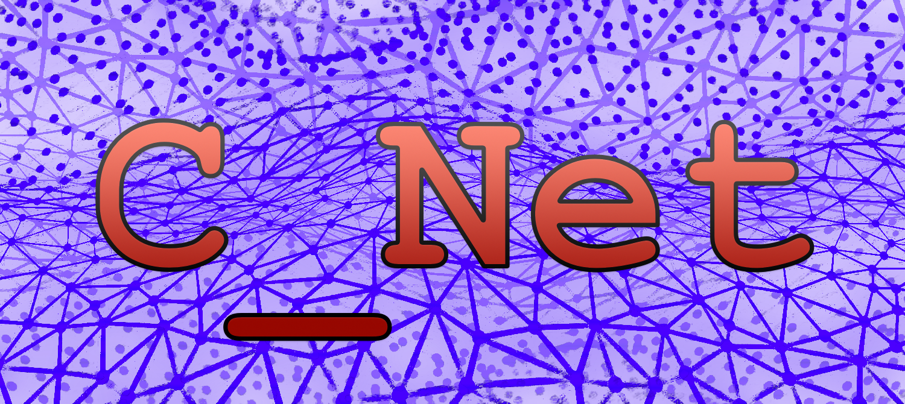
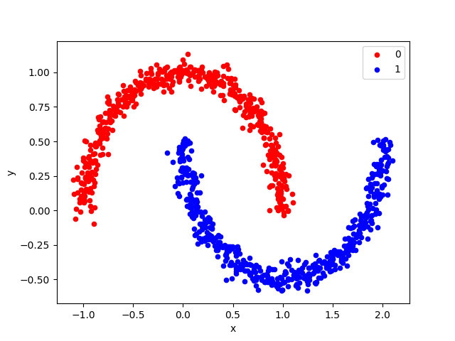
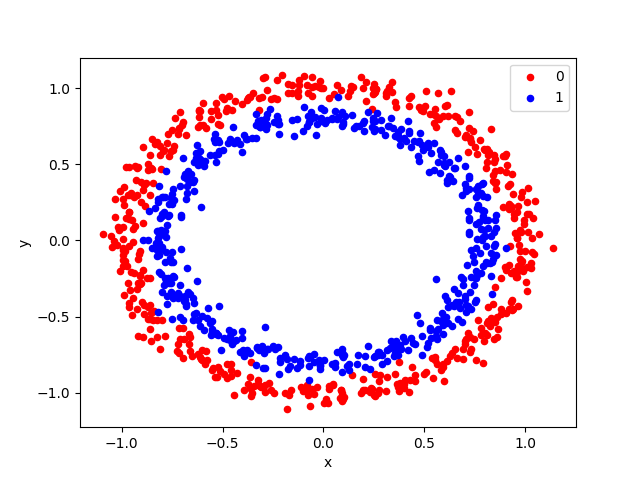

# An independently developed, object oriented neural network framework. Implemented from scratch in C++.


## Framework Overview:
__C_Net is an object oriented machine learning framework designed for programmers who want to build neural networks using C++.__ As a work in progress, C_Net currently enables users to build both simple and deep neural networks, in addition to CNNs (with 2D conv filters) and RNNs (with LSTM recurrent layers). 

C_Net allows users to build a neural network at two levels of abstraction: either as a computational graph of individual neurons, or as a sequence of connected of layers. The sequential model, similar to the one implemented by KERAS, allows users to __build and train networks with just a few lines of code.__

The framework currently provides support for the softmax loss function and a variety of activation functions. The __modular design__ allows other loss and activation functions can easily be added. The framework uses stochastic gradient descent and ADAM optimization to make parameter updates. Future work will include support for other optimizers, batch training, regularization, and parallelization techniques. Other areas of interest include built in support for __neural architecture search__ and __network morphism__ algorithms, to automatically find the optimal network architecture.

## Using The Sequential Model:
For those who have used the KERAS sequential model, building a neural network in C_Net should be a familiar task. The model allows users to stack layers of different types and specify the network's hyperparameters. The example below shows how a deep neural network can be built and trained in just __X__ lines of code, once the training and evaluation data sets are loaded.

#### Build a neural network with three hidden layers:
```cpp
// Initialize the network.
sequential_network the_network = sequential_network(learning_rate, beta_one, beta_two, distribution, softmax_loss);
    
// Set up the network's input layer.
the_network.add_input_layer(input_layer_size);
    
// Add a few fully connected layers, each containing a number of hidden neurons. Use a sigmoid activation.
the_network.add_fully_connected_layer(16, sigmoid, sigmoid_derivative);
the_network.add_fully_connected_layer(4, sigmoid, sigmoid_derivative);
the_network.add_fully_connected_layer(8, sigmoid, sigmoid_derivative);
    
// Add the output layer. Use a sigmoid activation.
the_network.add_fully_connected_layer(output_layer_size, sigmoid, sigmoid_derivative);
```
#### Train the network:
    the_network.train_network_for_epochs_with_data(num_epochs, training_inputs, training_labels, evaluation_inputs, evaluation_labels);


 
## Sequential model example with noisy, non-linear data:

The following full code example shows a sequential model network trained on datasets that are both noisy and contain non-linearities. The model built below performs well on both the "moons" and "circles" datasets, which each contain 1000 data points (75% training, 25% testing). The evaluation metrics include the average loss and confusion matrix for the epoch, in addition to the network's precision, recall, and F1 score.

| Moons |  Circles|
|--|--|
|  | |

#### Load the necessary header files.
```cpp
#include <iostream>
#include <random>
#include "neuron.h"
#include "sequential.h"
#include "activation_functions.h"
#include "cost_functions.h"
#include "tsv_data_loader.h"
#include "random_indexer.h"
using  namespace std;
```

#### Inside the main function, load the training and evaluation data.
```cpp
vector< vector<float> > training_inputs = load_data_from_tsv_file("circles_training_inputs.txt");
vector< vector<float> > training_labels = load_data_from_tsv_file("circles_training_labels.txt");
vector< vector<float> > evaluation_inputs = load_data_from_tsv_file("circles_evaluation_inputs.txt");
vector< vector<float> > evaluation_labels = load_data_from_tsv_file("circles_evaluation_labels.txt");
```


#### Then, set the hyperparameters.
```cpp
int num_epochs = 1000;
float learning_rate = 0.001;
float beta_one = 0.9;
float beta_two = 0.999;
normal_distribution<float> distribution(0.0, 1.0);
int input_layer_size = int(training_inputs[0].size());
int output_layer_size = int(training_labels[0].size());
```

#### Build and train the sequential network.
```cpp
sequential_network the_network = sequential_network(learning_rate, beta_one, beta_two, distribution, softmax_loss);
the_network.add_input_layer(input_layer_size);
the_network.add_fully_connected_layer(16, sigmoid, sigmoid_derivative);
the_network.add_fully_connected_layer(4, sigmoid, sigmoid_derivative);
the_network.add_fully_connected_layer(8, sigmoid, sigmoid_derivative);
the_network.add_fully_connected_layer(output_layer_size, sigmoid, sigmoid_derivative);
the_network.train_network_for_epochs_with_data(num_epochs, training_inputs, training_labels, evaluation_inputs, evaluation_labels);
```

#### Evaluation metrics at final three epochs:
    --------------------------------------------------------
    |  EPOCH: 998
    |  AVG LOSS:  0.349261
    |
    |  *  A  B  <--- pred
    |  A 111  6
    |  B 3  130
    |
    |  PRECISION: 0.973684
    |  RECALL:  0.948718
    |  F1:  0.961039
    --------------------------------------------------------
    --------------------------------------------------------
    |  EPOCH: 999
    |  AVG LOSS:  0.349137
    |
    |  *  A  B  <--- pred
    |  A 112  5
    |  B 4  129
    |
    |  PRECISION: 0.965517
    |  RECALL:  0.957265
    |  F1:  0.961373
    --------------------------------------------------------
    --------------------------------------------------------
    |  EPOCH: 1000
    |  AVG LOSS:  0.368578
    |
    |  *  A  B  <--- pred
    |  A 108  9
    |  B 5  128
    |
    |  PRECISION: 0.955752
    |  RECALL:  0.923077
    |  F1:  0.93913
    --------------------------------------------------------

# C_NET
C_Net was developed by Houston Wingo at the University of Alabama.

